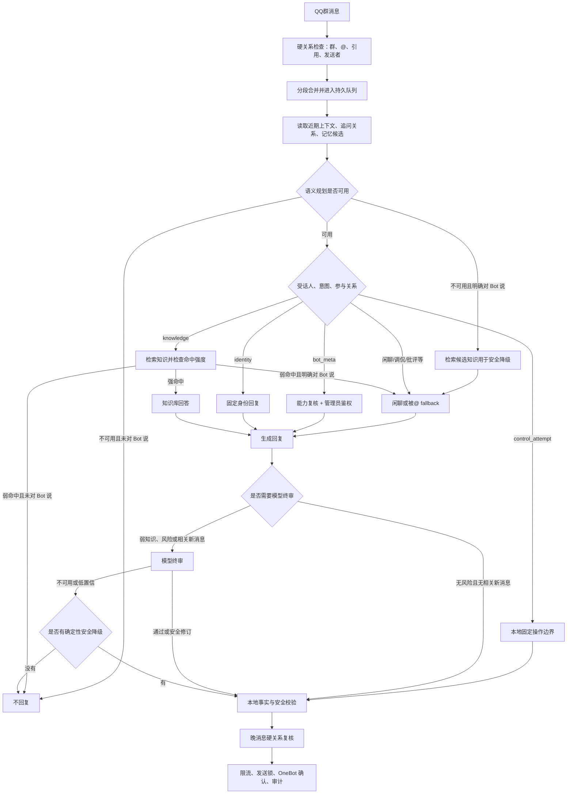
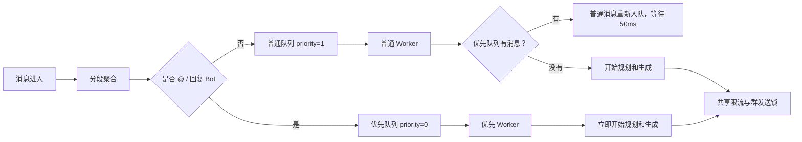

# 消息判断与队列链路

本文记录当前已部署版本的消息判断与队列行为。图中描述的是现状，不包含尚未实施的 P0-P3 两阶段调度方案。

## 消息判断链路

语义规划先决定消息进入知识问答、闲聊、Bot 内部信息或身份回复分支；只有知识意图和明确对 Bot 消息的安全降级才执行知识库检索。明确对 Bot 的消息和普通消息分别统计规划故障，互不触发对方的熔断。

终审故障时，强知识答案只有在没有相关上下文变化、没有风险标记且精确事实可由知识片段支持时才可继续发送；弱知识问题返回保守的资料不足答复，其余情况保持不回复。控制请求在生成前已经转为本地固定边界，不依赖生成或终审模型。

普通消息规划连续失败 5 次后暂停 30 秒；冷却结束时只允许一个半开探测请求，探测成功立即恢复，失败则重新冷却。明确对 Bot 的消息不受普通消息熔断影响。
健康接口分别暴露两条线路自进程启动以来的尝试数、不可用数、可用率、连续失败数、熔断状态和半开探测状态。

## 当前队列与软抢占

当前使用两条独立入口处理通道。本轮可靠性优化没有调整该队列结构。排队中的普通消息会为 @/回复 Bot 的消息让路；已经开始的普通模型请求不会被强制中断。

因此，当前优先级准确表达为：排队中的 @/回复 Bot 消息优先于普通消息，但不保证严格优先发送。最终发送仍受模型耗时、全局限流和群发送锁影响。
