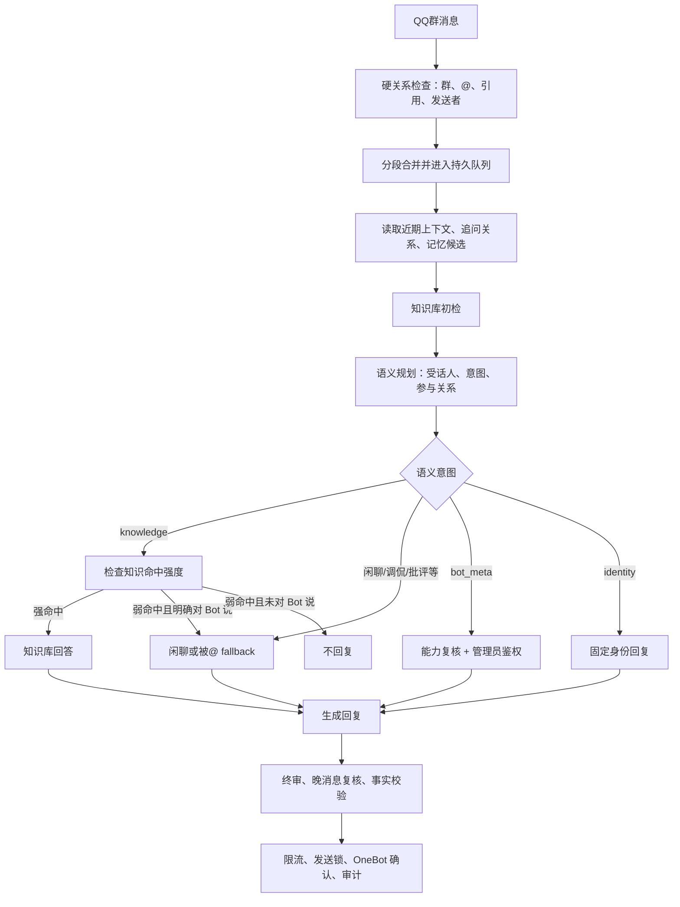
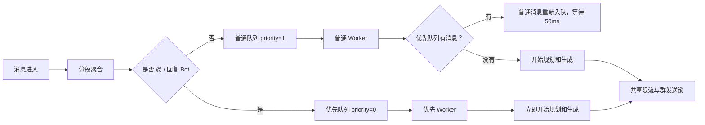

# 消息判断与队列链路

本文记录当前已部署版本的消息判断与队列行为。图中描述的是现状，不包含尚未实施的 P0-P3 两阶段调度方案。

## 消息判断链路

知识库初检只准备候选资料，语义规划结果才决定消息进入知识问答、闲聊、Bot 内部信息或身份回复分支。

## 当前队列与软抢占

当前使用两条独立入口处理通道。排队中的普通消息会为 @/回复 Bot 的消息让路；已经开始的普通模型请求不会被强制中断。

因此，当前优先级准确表达为：排队中的 @/回复 Bot 消息优先于普通消息，但不保证严格优先发送。最终发送仍受模型耗时、全局限流和群发送锁影响。
